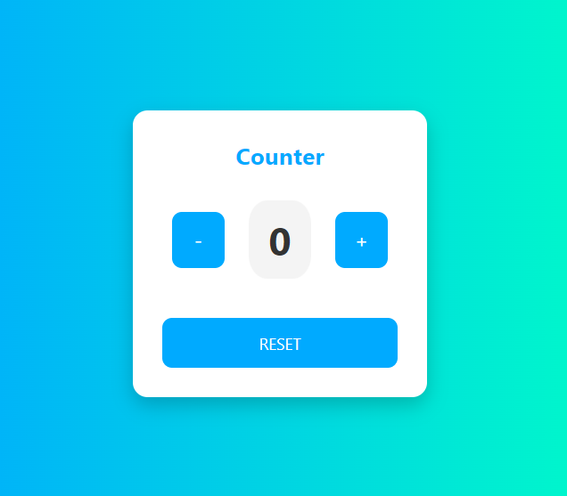

# Counter Application 🧮

## 📌 Descrizione

Questa è una semplice applicazione contatore sviluppata con **HTML, CSS e JavaScript puro**.  
L'utente può **incrementare, decrementare e resettare** il valore del contatore con i pulsanti.  

## 🚀 Funzionalità

✔️ Visualizzazione iniziale del counter impostata su `0`  
✔️ Pulsanti **+** e **-** per modificare il valore  
✔️ Pulsante **RESET** per riportare il contatore a `0`  
✔️ UI semplice e responsive  

## 🖥️ Screenshot

## 🛠️ Tecnologie Utilizzate

- **HTML5** → Struttura della pagina  
- **CSS3** → Stile e layout  
- **JavaScript** → Logica di funzionamento  

## 🚀 Come provare l'applicazione

Puoi provare l'app direttamente qui 👉 [**Counter App Live**](https://mirkosportelli.github.io/counter-app/)  
